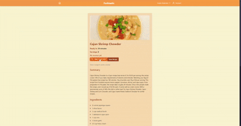

<!-- prettier-ignore -->
# Welcome to Forkalicious! 🍽️

      

## Description

Forkalicious is your AI-powered recipe companion, designed to help you discover, save, customize, and create delicious recipes with ease. Whether you're exploring new dishes from our vast Spoonacular API, fine-tuning your favorite meals, or generating entirely new recipes using AI, Forkalicious has you covered.

## 🚀 Tech Stack

This project is built using a state-of-the-art stack to ensure scalability, performance, and developer-friendly features:

- **Frontend:** React, TypeScript, Tailwind CSS
- **Backend:** Express.js, GraphQL, Mongoose, MongoDB
- **AI Integration:** OpenAI (ChatGPT) for intelligent recipe generation
- **External API:** Spoonacular API for fetching recipes
- **Authentication:** JSON Web Tokens (JWT)
- **Deployment:** Github Actions, Cloud hosting

## 📁 Table of Contents

- [Installation](#installation)
- [Usage](#usage)
- [Contributing](#contributing)

## Usage

1. View, Save, and Review Recipies


<br/>
<br/>
<br/>
<br/>
<br/>
<br/>

2. Change Account Information


<br/>
<br/>
<br/>
<br/>
<br/>
<br/>

3. Search for Recipes


<br/>
<br/>
<br/>
<br/>
<br/>
<br/>

4. Edit and Creating Recipes



<br/>
<br/>
<br/>
<br/>
<br/>
<br/>

5. AI Custom Recipies


<br/>
<br/>
<br/>
<br/>
<br/>
<br/>

6. Deleting a Recipe


<br/>
<br/>
<br/>
<br/>
<br/>
<br/>

## Installation

please visit [our deployed site](https://forkalicious.onrender.com) to access the application. If you want to run the application from your local machine, follow these instructions:

Ensure you have the Node Package Manager and MongoDB installed on your machine. You will need a JWT Secret Key, a Spoonacular API key, and optionally an OpenAI API key.

- [Node.js](https://nodejs.org)
- [MongoDB installation guide](https://www.mongodb.com/docs/manual/installation/)
- [Generate a JWT Secret Key](https://pinetools.com/random-string-generator)
- [Spoonacular API Key](https://spoonacular.com/food-api/console#Dashboard)
- [OpenAI API Key](https://platform.openai.com/settings/organization/api-keys)

```shell
# Step 1: clone this repository, and go to the root directory
git clone https://github.com/Dan-Swarts/Forktacular.git
cd Forkalicious

# Step 2: Ensure you have node installed, then use the Node
# Package Manager to install dependencies:
node -v
# Example output: v20.17.0
npm install

# Step 3: Ensure you have MongoDB installed on your machine.
# If needed, followed the MongoDB installation guide shown above.

# Step 4: remove the '.example' from .env.EXAMPLE. Fill in the
# .env file with the valid MongoDB URI for the installation in
# step 3, (the default is mongodb://127.0.0.1:27017/) JWT Secret
# Key, Spoonacular API Key, and optionally fill in the port
# number and/or the OpenAI API Key.

# Step 5: start the application:
npm run build && npm run start

# step 6: acess the application through your web browser
# http://localhost:3001/
```

## Contributing

> [!IMPORTANT]
> Whether you have feedback on features, have encountered any bugs, or have suggestions for enhancements, we're eager to hear from you. Your insights help us make the Forkalicious library more robust and user-friendly.

Please feel free to contribute by [joining the discussions](https://github.com/Caryndcarter/Forkalicious/discussions). Each contribution helps us grow and improve.

We appreciate your support and look forward to making our product even better with your help!
